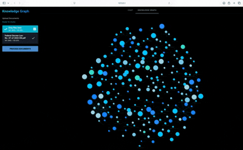

# Knowledge Graph RAG

This is a local Retrieval Augmented Generation (RAG) system that runs entirely on your machine. Built this to analyze documents without sending data to the cloud. It features an interactive graph view to see how concepts connect and a chat interface for asking questions.

## What It Does

Most RAG systems just give you text. This one builds a visual map of your data.



1.  **Document Processing**: You upload PDF or DOCX files. The system reads them, splits them into chunks, and saves them in memory.
2.  **Entity Extraction**: We use `spaCy` to find people, organizations, and key concepts in your text.
3.  **Graph Construction**: If two entities appear close together in the text (within 500 characters), we draw a line between them. The more often they appear together, the thicker the line.
4.  **Vector Search**: We use `FAISS` to index the text chunks. When you ask a question, we find the most relevant chunks using cosine similarity.
5.  **Local Inference**: A local LLM (`Qwen 2.5`) reads the relevant chunks and answers your question. It cites the specific filename and page number for every fact.

## Setup Instructions

Prerequisite: You need Python installed. We recommend using a virtual environment.

### 1. Installation

Clone this repo and install the dependencies.

```bash
git clone https://github.com/vikramlingam/knowledge-graph-rag.git
cd knowledge-graph-rag

# Create virtual env
python -m venv venv
source venv/bin/activate  # Windows users: use venv\Scripts\activate

# Install python libraries
pip install -r requirements.txt

# Download the NLP model for entity extraction
python -m spacy download en_core_web_sm
```

### 2. Running the App

```bash
python main.py
```

Go to `http://localhost:8080` in your browser.

**Note on Models**: The first time you run this, it will download about 600MB of model files.
-   LLM: `Qwen/Qwen2.5-0.5B-Instruct`
-   Embeddings: `sentence-transformers/all-MiniLM-L6-v2`

These are saved in the `models/` folder inside this directory. You can delete this folder if you want to clear the cache.

## How to Use

1.  **Upload**: Use the sidebar to upload your documents. Wait for the "Ready!" status.
2.  **Visualize**: Click the "Knowledge Graph" tab.
    -   Blue nodes are entities.
    -   Yellow lines show connections.
    -   Click a node to see exactly where that concept appears in your documents.
3.  **Chat**: Go to the "Chat" tab. Ask a question about your documents. The answer will include citations like `[Source: document.pdf (Page 5)]`.

## Technical Details

Use this section if you want to modify the code.

-   **Frontend**: Built with `NiceGUI`. It handles the file uploads and the chat interface.
-   **Graph Rendering**: Used `Vis.js` injected via JS. The physics simulation uses the `ForceAtlas2Based` solver for stability.
-   **LLM**: The model runs on the CPU using `transformers`. I used the `0.5B` version of Qwen because it is fast enough to run on standard laptops without a GPU. But you can replace this with any LLM of your choice.
-   **Storage**:
    -   `vector_store`: In-memory FAISS index.
    -   `graph_data`: JSON structure built on the fly with NetworkX logic.

## Project Structure

-   `main.py`: The UI and app entry point.
-   `src/knowledge_graph.py`: Logic for extracting entities and relationships.
-   `src/rag.py`: Vector database operations.
-   `src/local_llm.py`: Logic for loading and running the Qwen model.
-   `src/ingestion.py`: Handles PDF and DOCX file reading.

## Author

**Vikram Lingam**  
[GitHub Profile](https://github.com/vikramlingam)


